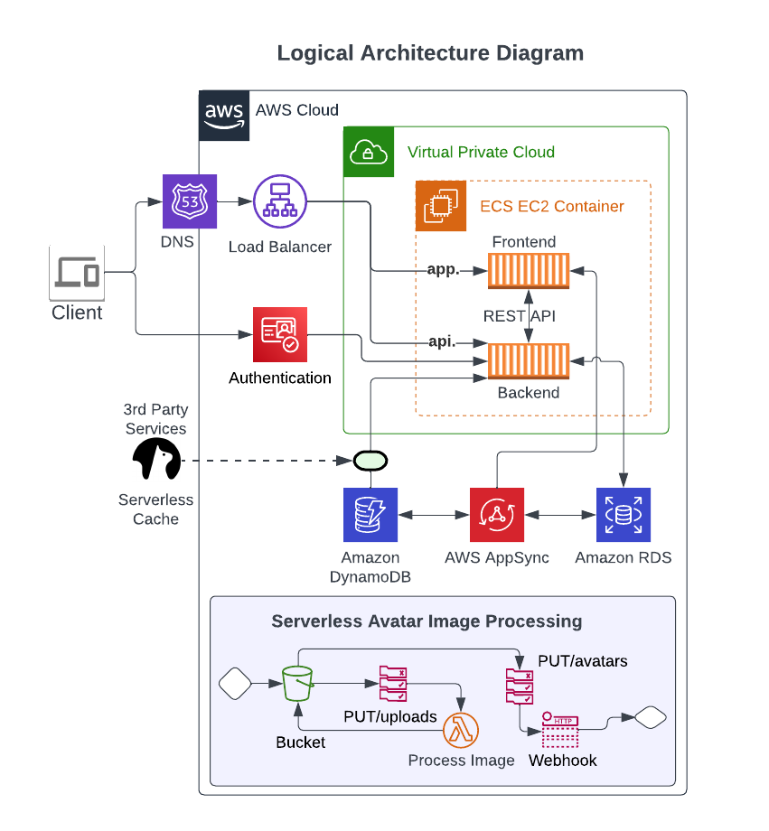
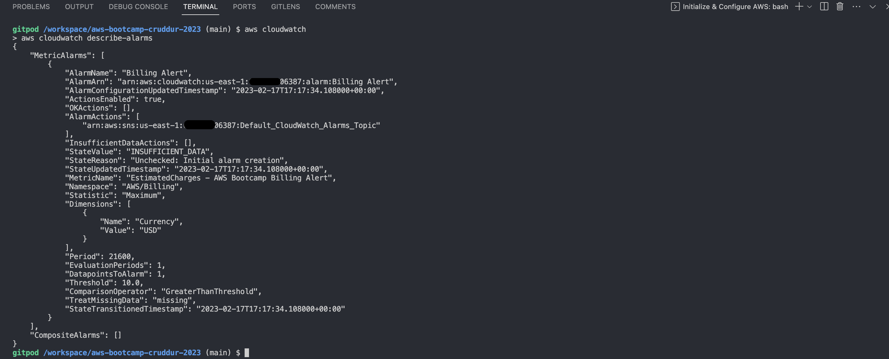
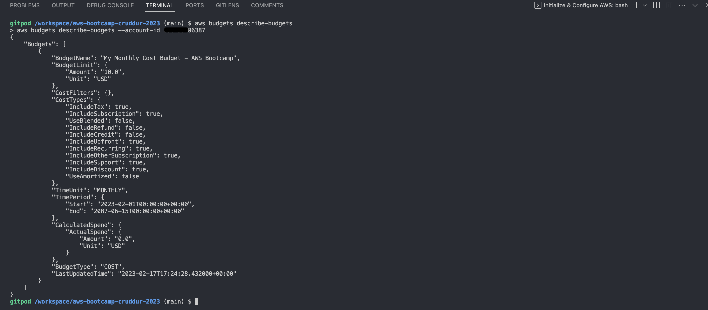

# Week 0 — Billing and Architecture

## Conceptual Architecture Diagram


###
[Lucidchart - Conceptual Architecture Diagram](https://lucid.app/lucidchart/2bf96275-cfe2-4990-bdcd-1ff2a3e3e9d7/edit?invitationId=inv_1b85adcd-02b5-4f51-9fdc-8fa51868fc71)

***

## Logical Architecture Diagram


###
[Lucidchart Logical Architecture Diagram](https://lucid.app/lucidchart/c5049a3e-eeff-458e-a63b-a363c547e187/edit?viewport_loc=-81%2C-29%2C2048%2C1085%2C0_0&invitationId=inv_88f1477c-0ad5-4e3e-9db2-a0b179b3b578)

***

## Setup AWS Account
1. I have protected the root account by Enabling MFA.
2. Enabled Organizations in AWS account and setup a user called **madhu** in AWS Identity Center. 
3. Enabled SSO for the user for AWS Console login and enabled MFA. 

## Setup AWS Cloudshell


## Setup Gitpod


I have configured AWS Environment Variables in Gitpod [here](https://gitpod.io/user/variables).

```bash
AWS_SSO_URL 
AWS_SSO_REGION 
AWS_ACCOUNT_ID 
AWS_ROLE_NAME 
AWS_REGION
```
I have setup gitpod configuration for this repository by referring document [[1]](#references) which I have linked in references.

## Enable Billing
I have turned on Billing Alerts from AWS Console to recieve alerts.

## Create a Billing Alarm
I have setup Billing alarm in AWS Console. Please find below AWS CLI output showing Cloudwatch Alarm.




## Create an AWS Budget
I have setup monthly cost Budget in AWS Console referring to AWS documentation [[2]](#references). 

Please find below AWS CLI output describing the Budget. 



## References

1. [Integrate AWS Single Sign-On (SSO) and Amazon Elastic Container Registry (ECR) with Gitpod](https://www.gitpod.io/guides/integrate-aws-cli-ecr)
2. [AWS Billing and Cost Management Documentation: Using a budget template (simplified)](https://docs.aws.amazon.com/cost-management/latest/userguide/budget-templates.html)
